# SAAF Tutorial

This tutorial provides a comprehensive introduction to SAAF and FaaS Runner. 

## Overview:
* [Download SAAF](#download)
* [Install Dependencies](#install)
* [Writing a Hello World function](#writeFunc)
* [Deploying Functions](#deploy)
* [Testing Functions](#test)
* [Introduction to FaaS Runner](#faas-runner)


# <a name="download"></a> Download SAAF

To download and get started using SAAF, simply clone the GitHub repository either using git through the command line or from the webpage:

```bash
git clone https://github.com/wlloyduw/SAAF.git
```

# <a name="install"></a> Install Dependencies

If you are using Ubuntu you can easily download all dependencies and configure each FaaS platform's CLI by using our quickInstall script:

```bash
curl -O https://raw.githubusercontent.com/wlloyduw/SAAF/master/quickInstall.sh
sudo chmod 777 quickInstall.sh
./quickInstall.sh
```

If you would like to manually download SAAF dependencies you can simply run one of the commands below:

```bash
# Ubuntu (Recommended)
sudo apt update
sudo apt install parallel bc curl jq python3 python3-pip nodejs npm maven
pip3 install requests boto3 botocore

# MacOS with Brew
brew update
brew install parallel bc curl jq python3 python3-pip nodejs npm maven
pip3 install requests boto3 botocore
```
## Setting up AWS Lambda

Download the AWS CLI and use aws configure to setup. Enter your AWS access and secret key, set your region (e.g. us-east-1) and finally set the output format to json.

```bash
# Ubuntu
sudo apt install awscli python3 python3-pip
pip3 install --upgrade awscli
aws configure

# MacOS with Brew
brew install awscli python3 python3-pip
pip3 install --upgrade awscli
aws configure
```

Other platforms such as Google Cloud Functions, IBM Cloud Functions, and Azure Functions can be setup using the quickInstall.sh script.

## Verify Installation

To check to make sure the AWS CLI has been configured properly run the following command and verify it runs without errors.

```bash
aws lambda list-functions
```

# <a name="writeFunc"></a> Writing a Hello World Function

The root directory of the SAAF project contains function templates for Java, Node.JS, Python, and Bash. Each template includes a /src, /deploy, and occasionally a /platforms folder. Each language includes the source code from a simple hello world function with SAAF implemented in the /src directory. The /deploy directory contains our multi-platform publish and test scripts that are able to repackage projects and deploy them to multiple FaaS platforms. Finally, the /platforms folder contains platform specific files, in general nothing in this folder needs to be edited.

For the remainder of the tutorial we will focus on the /python_template directory, as Python is a simple language to run and is supported by all FaaS platforms.

```bash
# Enter the Python Template and open the handler.py file.
cd python_template/src
nano handler.py
```

The default handler.py contains a bit more than a default function for a FaaS platform. Here we have implemented SAAF's Inspector object, which allows users to collect data about FaaS platforms. At the start of functions with SAAF, the Inspector needs to be instantiated (not in global scope), then initial metrics can be inspected using the inspectCPU, inspectMemory, inspectPlatform, inspectContainer, inspectLinux, or inspectAll functions.

After initial inspection, the workload of the function should be started. In this case, it is simply adding the "Hello World" message to the inspector.

Finally, at the end of functions the final delta metrics need to be inspected. Simply call the inspectCPUDeltas, inspectMemoryDeltas, or inspectAllDeltas functions. Then all the data from SAAF can be finalized and returned with the finish() function.

```python
# This is just to support Azure.
# If you are not deploying there this can be removed.
import os
import sys
sys.path.append(os.path.abspath(os.path.join(os.path.dirname(__file__))))

import json
import logging
from Inspector import *
import time

#
# Define your FaaS Function here. 
# Each platform handler will call and pass parameters to this function.
# 
# @param request A JSON object provided by the platform handler.
# @param context A platform specific object used to communicate with the cloud platform.
# @returns A JSON object to use as a response. 
#
def yourFunction(request, context):
    # Import the module and collect data
    inspector = Inspector()
    inspector.inspectAll()

    # Add custom message and finish the function
    if ('name' in request):
        inspector.addAttribute("message", "Hello " + str(request['name']) + "!")
    else:
        inspector.addAttribute("message", "Hello World!")
    
    inspector.inspectAllDeltas()
    return inspector.finish()
```

Using SAAF in a function is as simple importing the framework and adding a couple lines of code. Attributes collected by SAAF will be appended onto the JSON response. For asynchronous functions, this data could be stored into a database, such as AWS S3, and retrieved after the function is finished.

SAAF functions return data in the json payload of functions. For example here is what the output looks like from inspecting the CPU:

```json
{
	"version": 0.2,
	"lang": "python",
	"cpuType": "Intel(R) Xeon(R) Processor @ 2.50GHz",
	"cpuModel": 63,
	"vmuptime": 1551727835,
	"uuid": "d241c618-78d8-48e2-9736-997dc1a931d4",
	"vmID": "tiUCnA",
	"platform": "AWS Lambda",
	"newcontainer": 1,
	"cpuUsrDelta": "904",
	"cpuNiceDelta": "0",
	"cpuKrnDelta": "585",
	"cpuIdleDelta": "82428",
	"cpuIowaitDelta": "226",
	"cpuIrqDelta": "0",
	"cpuSoftIrqDelta": "7",
	"vmcpustealDelta": "1594",
	"frameworkRuntime": 35.72,
	"message": "Hello Fred Smith!",
	"runtime": 38.94
}
```
The attributes collect can be customized by changing which functions are called. For more detailed descriptions of each variable and the functions that collect them, please see the framework documentation for each language:
https://github.com/wlloyduw/SAAF/blob/master/python_template 

# <a name="deploy"></a> Deploying Functions

Each language comes with a publish.sh script in that can be used to simplify the process of deploying functions and remove the need to visit each cloud provider's website. This script is located in the /deploy folder of each language template. SAAF's deployment tools allow a function to be written once and then automatically packaged, deployed, and tested on each platform. 

Function deployments are defined by the config.json file in the /deploy folder. Here is an example config.json file:

```json
{
	"functionName": "hello",

	"lambdaHandler": "lambda_function.lambda_handler",
	"lambdaRoleARN": "{REQUIRED FILL THIS IN}",
	"lambdaSubnets": "",
	"lambdaSecurityGroups": "",
	"lambdaEnvironment": "Variables={EXAMPLEVAR1=VAL1,EXAMPLEVAR2=VAL2}",
	"lambdaRuntime": "python3.7",

	"googleHandler": "hello_world",
	"googleRuntime": "python37",

	"ibmRuntime": "python:3",

	"azureRuntime": "python",

	"test": {
		"name": "Bob"
	}
}
```

Config files contain all of the needed information to deploy the function. For AWS Lambda, the only attribute that needs to be modified is the **lambdaRoleARN**. The ARN can be found by editing the Lambda function configuration in the AWS management console web GUI. Scroll down and locate Basic Settings. Click EDIT. Under “Basic Settings” the Execution role. Under existing role, click on the blue link that says “View the <role name> role”.

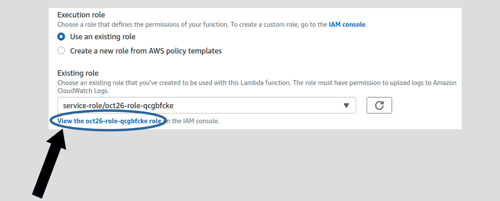

Once clicked, the IAM console should open showing the complete ARN role.


Once you have found your roll ARN, copy and paste it into the config.json file in the deploy folder. Congratulations you can now deploy functions using SAAF! This setup process is exactly the same for all languages. For other platforms, you do not need to change any of the default values.

To use the publish script, simply follow the directions below:

1. Install all dependencies and setup each cloud's provider's CLI. This can be done using quickInstall.sh
2. Configure config.json. Fill in the name of your function, a AWS ARN (if deploying to AWS Lambda), and choose a payload to test your function with.
3. Run the script. The script takes 5 parameters, the first four are booleans that determine what platforms to deploy to and the final is a memory setting to use on supported platforms.

### Example Usage:

``` bash
# Description of Parameters
./publish.sh AWS GOOGLE IBM AZURE Memory

# Deploy to AWS and Azure with 512 MBs memory setting:
./publish.sh 1 0 0 1 512

# Deploy to Google and IBM with 1GB memory setting:
./publish.sh 0 1 1 0 1024

# Deploy to all platforms with 128 MBs memory setting:
./publish.sh 1 1 1 1 128

# Deploy to AWS with 3GBs memory setting:
./publish.sh 1 0 0 0 3008
```
If functions are already deployed the publish script will update the configuration and code of a function.

# <a name="test"></a> Testing Functions

# <a name="faas-runner"></a> Introduction to FaaS Runner

To begin, using git, create a new directory and clone the GitHub repository for this tutorial.

```bash
git clone ​https://github.com/RCordingly/faas_runner_tutorial
```

SAAF Documentation: ​https://github.com/wlloyduw/SAAF/tree/master/java_template 

FaaS Runner Documentation: ​https://github.com/wlloyduw/SAAF/tree/master/test

## Deploy the Included Functions

Included in the repository are four functions that need to be deployed to AWS Lambda. To simplify this process, SAAF's built in publish scripts can be used to deploy them automatically. The repository contains three 'Hello World' functions; pello_world, jello_world, and nello_world, and the CalcsService function.
The Jello/Pello/Nello naming is because these are Hello World functions written in ​J​ava, ​P​ython, and ​N​ode.js respectively. SAAF supports functions written in each of these languages.

To deploy these, we must first configure each config.json file with a role ARN. You should already have an ARN created earlier in this tutorial so you can retrieve that by visiting the AWS webpage, go to IAM -> Roles and select the role you would like to use.

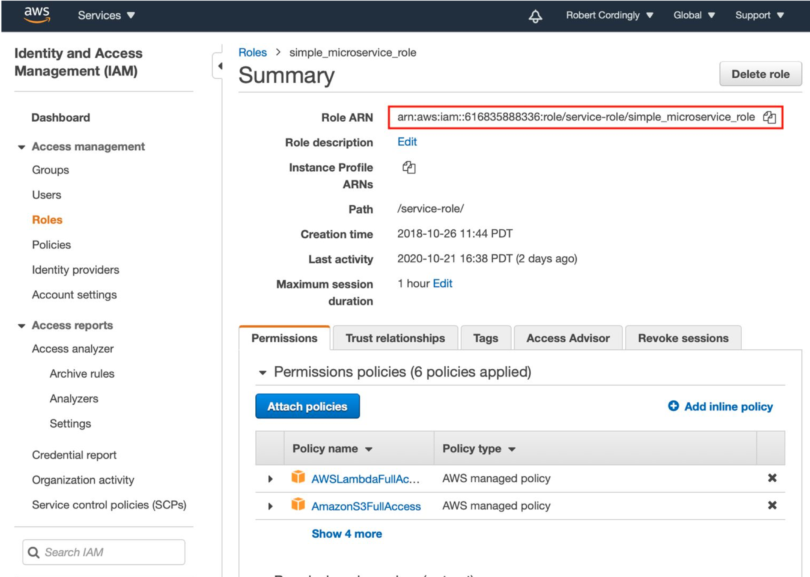

Copy your ARN shown at the top of the page. All functions can share the same ARN. Next open the ​**config.json** files located in each function's **​deploy**​ folder and paste the ARN into the JSON attribute called​ **lambdaRoleARN​**. **No other attributes in the config files need to be changed.**

You may use any text editor to enter the ARN. The example below shows opening each file in Nano.

```bash
cd {base directory where project was cloned}
nano pello_world/deploy/config.json
nano jello_world/deploy/config.json
nano nello_world/deploy/config.json
nano calcService/deploy/config.json
```

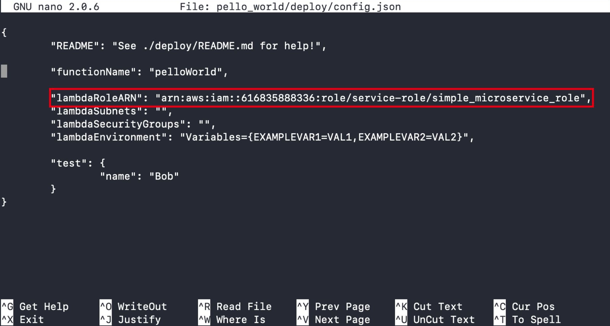

## Deploy Each Function

Once each configuration file has an ARN, each function should be able to be deployed using the publish scripts.

```bash
cd {base directory where project was cloned}
# ./publish.sh AWS GCF IBM AZURE MEMORY
./pello_world/deploy/publish.sh 1 0 0 0 1024
./jello_world/deploy/publish.sh 1 0 0 0 1024
./nello_world/deploy/publish.sh 1 0 0 0 1024
./calcs_service/deploy/publish.sh 1 0 0 0 1024
```

The publish scripts automatically package functions and can deploy them to AWS Lambda, Google Cloud Functions, IBM Cloud Functions, and Azure Functions. Here we are just deploying to AWS Lambda with a memory reservation setting of 1024 MBs. The publish scripts can be used to deploy new functions or update existing functions.

To verify that each deployment was successful, the publish script will automatically invoke the function with the **​test**​ payload in the config file. Verify that each function was deployed and executed successfully. The output should look similar to the example below.

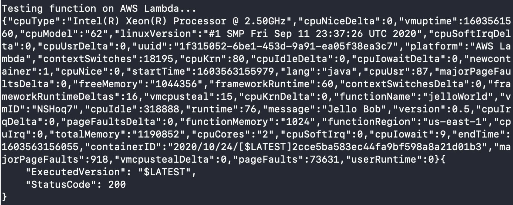

Each function should now be visible on the AWS Lambda web page:

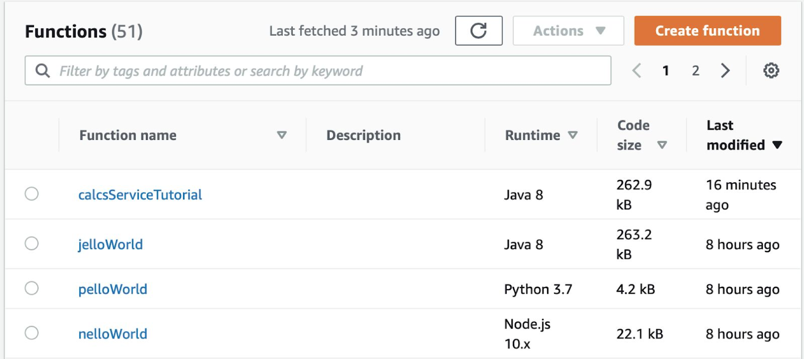

## Running an Experiment with FaaS Runner

Now that we have all of our functions deployed, we will begin running some experiments with FaaS Runner. To work with FaaS Runner, open the ​test​ folder in a terminal and execute the ​**faas_runner.py​** script.

FaaS Runner uses two types of files. Function files, which define the endpoints needed to execute a function, and experiment files that define how to process an experiment. Let's execute the built-in calcsService experiment to get an understanding of what FaaS Runner is doing and how the output is recorded.

```bash
cd ./test
./faas_runner.py -f ./functions/calcsService.json ​​-e ./experiments/calcsServiceExp1.json
```

The **​-f** ​flag defines the path to the function file and ​**-e** defines the path to the experiment file. After executing this function FaaS Runner should execute the entire experiment and automatically open a spreadsheet on MacOS and Linux.

FaaS Runner produces a lot of output text to show what is going on. It is broken into section that will be explained here.

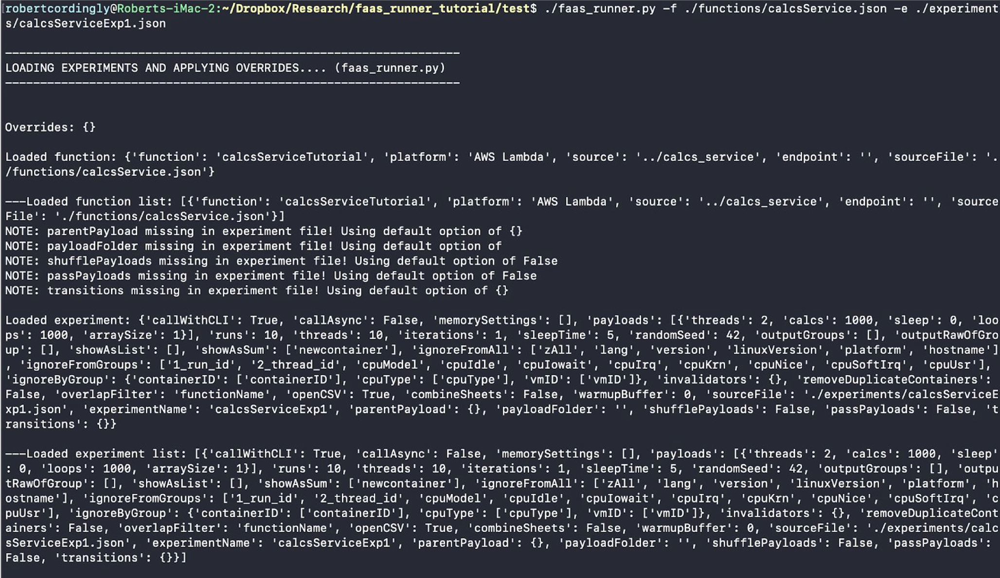

The first section is where the function information and experiment data are loaded. Here you can see the list of loaded functions, and the list of loaded experiments. For this experiment we only have one function and one experiment. If an experiment or function file is missing attributes (such as in this example ​**parentPayload, payloadFolder, shufflePayloads, passPayloads,** ​and​ **transitions**​) default values will be used instead.


The second section applies any modifications to payloads if you choose to use inheritance. FaaS Runner has the ability to define parent payloads that children can inherit values from. This can be useful if you have an experiment but want to override some attribute instead of recreating the entire experiment file. In this first example we are not using this feature.

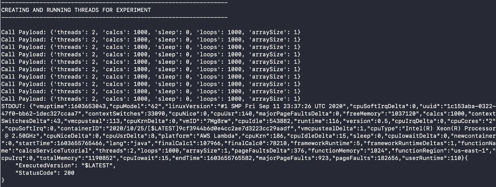

Next we have the section where functions are actually being invoked. At the start you can see the payloads of each function invocation and then shortly later you begin seeing the results of each run denoted by ​**STDOUT**​. For long running experiments this section can be useful to make sure an experiment is executing properly.


The next section is where the report is generated. The text shown here is the raw text of the CSV data that will be opened as a spreadsheet.


The final section is where files are written to disk. If an output path is not defined, FaaS Runner automatically saves data to the ​**history** folder. Navigate to that folder and view its contents. After running this experiment, you should see the CSV report alongside a folder with the same name. The folder will contain the JSON response payloads of each run in the experiment. This data can be used to regenerate a report.

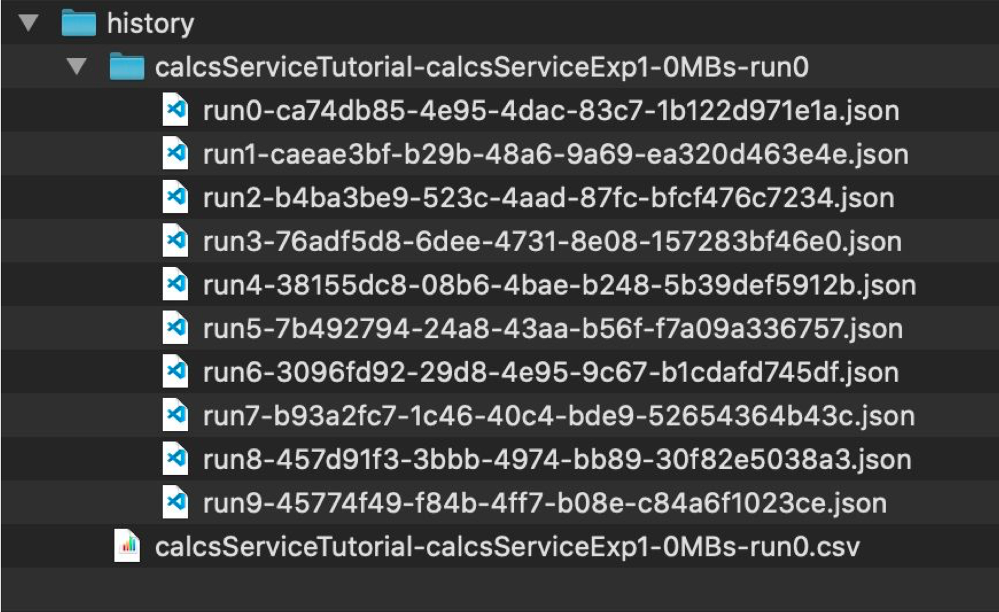

## Overriding Attributes with Command Line Arguments

Next, let's create a more complex experiment with CalcsService. We will use the same experiment and function files but override attributes using command line arguments. Any attribute in function or experiment files can be defined through command line arguments.

For this experiment we are going to use the same workload but repeat it with different memory settings. FaaS Runner can automatically reconfigure memory settings on all supported platforms. This experiment will take a couple minutes.

```bash
mkdir memorySettingExperiment
./faas_runner.py -f ./functions/calcsService.json -e ./experiments/calcsServiceExp1.json --memorySettings [256, 512, 1024, 2048]​ ​--openCSV false​ ​-o memorySettingExperiment
```

This is the most complex experiment yet so let's see what is going on. We are defining the same function and experiment files (denoted with the **​-f** ​and **​-e** ​flags). Then we are overriding the experiment file's **memorySettings** ​attribute. Overriding attributes can be done by simply using the attribute name as a flag with '--' at the start. The memorySettings attribute is expected to be a list of memory settings you want to use. In this case we are using 256 MBs, 512 MBs, 1024 MBs, and 2048 MBs. Next we are overriding the ​**openCSV** attribute to be false. For larger experiments it can be annoying having many CSV files automatically opened so we will retrieve this information later. Finally, we define the output path by using the ​**-o** flag to be our newly created ​**memorySettingExperiment** ​folder. The order of command line arguments does not matter.

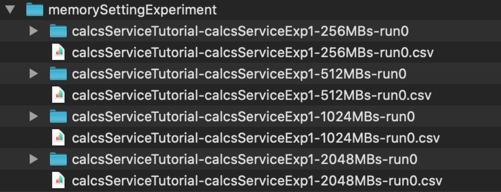

Just like with the first experiment, if we open the output folder, we can now see CSV reports and folders of JSON files for each memory setting.

## Creating a Unified Report

Instead of having 4 different reports for each memory setting, lets combine all the runs into one report. To do this we must first create a folder will all of the json files. This can be easily done through the command line.

```bash
cd memorySettingExperiment
mkdir combined
cp -R **/*.json ./combined
cd ..
```

Next we can use the ​**compile_results.py** ​script to create a single report with all 40 runs. Simply supply the path to the folder of json files (**​./memorySettingExperiment/combined**​) and then the path to an experiment file (**​./experiments/calcsServiceExp1.json​**).

```bash
# ./compile_results.py {FOLDER PATH} {PATH TO EXPERIMENT JSON}
./compile_results.py ./memorySettingExperiment/combined ./experiments/calcsServiceExp1.json
```

This should generate a report such as the one shown below.

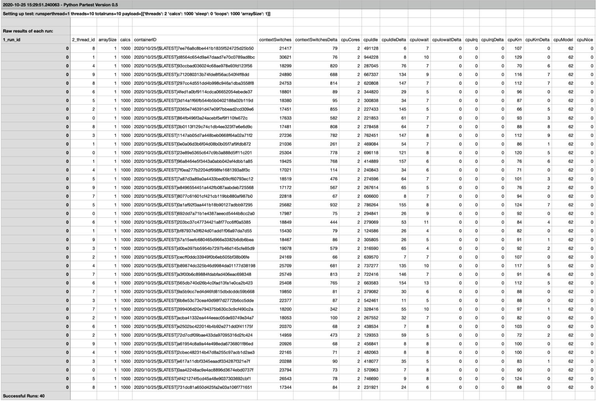

 Now that we can regenerate reports, this gives us the ability to create experiment files dedicated to formatting a report. Let's create a new experiment file to categorize this data.

```bash
cd ./experiments
cp calcsServiceExp1.json report.json
nano report.json
cd ..
```

Edit the report.json file so that the ReportGenerator will create groups based on the ​**functionMemory** attribute.

FaaS Runner has the ability to automatically aggregate data returned by functions. By adding an attribute to the ​**outputGroups** attribute in an experiment file the ReportGenerator will automatically group runs with shared values together. For example if you run an experiment with 256MBs and 512MBs of memory, grouping by functionMemory will automatically calculate the average of all runs at each memory setting. By adding an attribute to **​outputRawOfGroup** the ReportGenerator will simply print out the raw data of an entire group together in one block of CSV. These two attributes can be incredibly useful to get quick experiment results without having to use other tools like Excel.

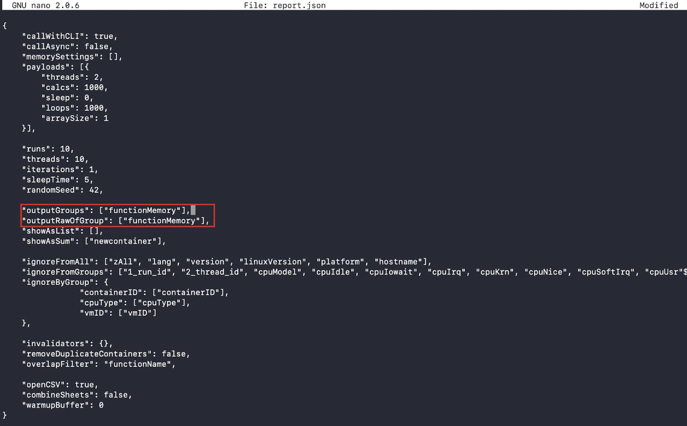

Once edited and saved, run the **​report_compiler.py**​ script again with the newly created **​report.json** ​file.

```bash
./compile_results.py ./memorySettingExperiment/combined ./experiments/report.json
```

In the report you should now see aggregated categories for functionMemory. Alongside that, the results of each run should also be consolidated together in the report.

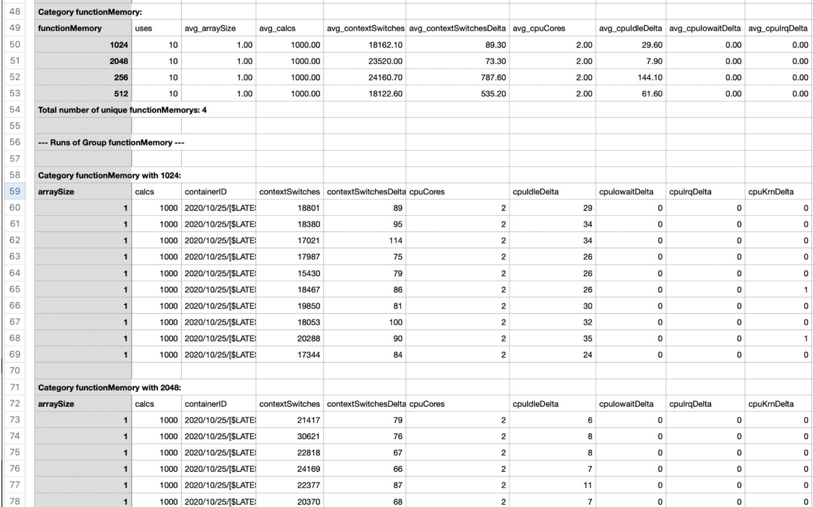

## Creating Complex Experiments with Scripts

Now that you have the ability to run multiple experiments and combine the results together into one report, we can create even more complex experiments with FaaS Runner. For the most complex experiments it is best to create a script that then invokes FaaS Runner. We can leverage many features of FaaS Runner to improve this process.

For this experiment we will use all the features of our calcsService application. CalcsService is a CPU bound workload that does random math (a * b / c). The amount of calculations can be defined using the calcs attribute. For our next experiment we want to add variability to our runtime and measure how runtime changes as the number of calculations increases or decreases. To do this we can add many payloads to the list of **​payloads** attribute and FaaS Runner will distribute them between function invocations. Here we will use payload inheritance to define a single ​**parentPayload** ​that will contain attributes that all function invocations will use. Then the values in the **​payloads**​ list will override the values in the ​**parentPayload​** if there are conflicts.

Next, we want to measure the impact of the FaaS freeze/thaw lifecycle. After a memory value is changed all infrastructure allocated to the function will be destroyed, entering the function into a luke-warm state where the application code is cached but infrastructure must be reallocated. To fully achieve the “cold” state we must wait around 45 minutes. To measure the impact of the “luke-warm” state we simply need to run an experiment a second time after getting to the luke-warm state. So one experiment run is in the luke-warm state and the next will be warm. This same methodology can apply when comparing cold to warm states. To run an experiment twice in succession we can use FaaS Runner’s **​iterations**​ attribute.

On AWS Lambda, the CPU allocated to a function varies in performance depending on the memory setting assigned to a function. At low settings (<256MBs) a function may have allocated 1/10 of a single CPU core up to over 2 CPU cores after 1536MBs. We can measure this performance variability by executing an experiment across multiple memory settings. Like we did in the previous experiment, we can define multiple memory settings using the ​**memorySettings**​ attribute in FaaS Runner.

Finally, the calcsService application has the feature to produce memory stress by setting the ​**arraySize** attribute to a large number. When doing random math (a * b / c), calcsService does not use primitive variables (e.g. int/double) but instead creates arrays and accesses the random numbers from those arrays. By setting arraySize to be a large number (e.g. 1,000,000) we create memory stress in two ways. First, creating large arrays requires allocating and freeing large amounts of memory. Second, the numbers to do math with are assigned and read from random indices in the arrays. Reading and writing to random positions in memory can greatly impact performance as it can cause something called page faults. Pieces of memory are frequently cached in different levels of memory (e.g. L1/L2/L3) so when an application reads something that is not cached a slowdown occurs. We can measure the memory performance of AWS Lambda by running the experiment once without memory stress (arraySize = 1) and with memory stress (arraySize = 1000000).

Here is the summarized process of what we want the experiment to do:

1. Vary the number of calculations (calcs) calcsService does between 1,000 and 100,000 in steps of 1,000 in each experiment run.
2. Repeat the experiment a second time to measure cold/warm performance.
3. Change memory setting between 256 MBs, 1024 MBs and 2048 MBs.
4. Repeat all the steps once again with memory stress (arraySize = 1,000,000).

We can create a bash script to easily create FaaS Runner arguments and execute this experiment. The script is included below. Review comments to see what arguments are being defined. Save and execute this script as ​**complexTest.sh** in the ​**test** directory. This experiment will take a few minutes to complete.

```bash
#!/bin/bash

# FaaS Runner Complex Experiment Example 
# @author Robert Cordingly

# Define Experiment Arguments
args=​"--function calcsServiceTutorial ​--runs 100 --threads 100 --warmupBuffer 0 --combineSheets 0 --sleepTime 0 --openCSV 0 --iterations 2 --memorySettings [256, 1024, 2048]"

# Create parent payload.
parentPayloadNoMemory=​"​{​\"​threads​\"​:2,​\"​sleep​\"​:0,​\"​loops​\"​:1000,​\"​arraySize​\"​:​1​}​" parentPayloadMemory=​"​{​\"​threads​\"​:2,​\"​sleep​\"​:0,​\"​loops​\"​:1000,​\"​arraySize​\"​:​1000000​}​"

# Generate scaling number of calcs payloads. 
#
# This creates a list of payloads like this:
# [{"calcs":1000},{"calcs":2000},...,{"calcs":99000},{"calcs":100000}] start=1000
step=1000
end=100000
payloads=​"​[​"
for​ ​calcs​ ​in​ ​$(​seq ​$start​ ​$step​ ​$end​) 
do
	payloads=​"​$payloads​{​\"​calcs​\"​:​$calcs​}​" ​
	if​ [ ​"​$calcs​"​ ​-lt​ ​"​$end​"​ ]
	​then
		payloads=​"​$payloads​,​" ​
	else
		payloads=​"​$payloads​]​" 
	​fi
done

# Created Payloads List:
echo​ ​"​Created Payloads List:​" 
echo ​$payloads

# Create Output Folders
mkdir complexExperiment
mkdir complexExperiment/NoMemory 
mkdir complexExperiment/Memory

# Run Experiments with and without Memory Stress
./faas_runner.py​ -o ./complexExperiment/NoMemory --payloads ​$payloads​ --parentPayload ​$parentPayloadNoMemory​ ​$args 
./faas_runner.py​ -o ./complexExperiment/Memory --payloads ​$payloads​ --parentPayload ​$parentPayloadMemory​ ​$args

echo​ ​"​Experiments Done!​"
```

This script leverages FaaS Runner's payload inheritance. We first create a ​**parentPayload** that contains attributes that all function invocations in an experiment will use. In this case we create two parents, one with memory stress and one without. Then we create the **​payloads** attribute to vary the number of calculations. This list of payloads will be distributed randomly between the threads. Finally, we define all other attributes in the **args** variable. This script also creates a few folders to keep our output organized. Unlike previous experiments, this experiment does not use any experiment or function files. Everything is defined through command line arguments and makes use of FaaS Runner's default parameters. For example, by default FaaS Runner assumes you are using AWS Lambda. Save and execute this script as **​complexTest.sh** in the **​test** directory. This experiment will take a few minutes to complete.

```bash
# Run the Experiment
cd ./test
./complexTest.sh
```

**Task 1:** Create a single report with all data from the complex experiment. In your ​report.json file add "​newcontainer" and ​"arraySize" to the ​outputGroups list just like you did in section 6 for ​functionMemory​. Copy all json files from both the NoMemory and Memory folders into one combined folder. Run the report_compiler.py​ script on the folder to generate the report.

FaaS Runner can aggregate data for any attribute returned by a function. For all data returned by SAAF and their definitions see: ​
https://github.com/wlloyduw/SAAF/tree/master/java_template

For all FaaS Runner experiment execution, data aggregation, and report generation options see:
https://github.com/wlloyduw/SAAF/tree/master/test

```bash
# Create a single report.
cd ./complexExperiment
mkdir combined
find . | grep json | xargs -I{} -n1 cp '{}' ./combined/
cd ..
./compile_results.py ./complexExperiment/combined ./experiments/report.json
```

**Task Questions**:
1. Read the report and scroll down to the aggregated results for ​newcontainer​, what was the impact on
the avg_userRuntime column of the cold (newcontainer = 1) versus warm (newcontainer = 0)?
2. What was the impact of memory stress on average runtime? Look at the aggregated results for
arraySize​.
3. What was the impact of different memory settings on average runtime? Look at the aggregated results
for ​functionMemory​.

## Using FaaS Runner with Function Pipelines

Alongside running individual functions, FaaS Runner can execute complex pipelines of functions. To begin we must first explain the syntax. To execute a pipeline, you must define lists of ​functions and ​experiments​. Like with single function calls, both functions and experiments can be defined through either files or command line arguments. For these examples we will use both.

Using the included function and experiment files. Try executing this experiment:

```bash
./faas_runner.py -f ./functions/jello.json ./functions/pello.json ./functions/nello.json -e ./experiments/jello.json ./experiments/pello.json ./experiments/nello.json
```

Now let's explain what happened. The first experiment, in this case ​**jello.json**​, ​is considered our parent experiment. This experiment file defines how many runs are going to be executed, the number of threads, and will be used to generate the report. In this case, this experiment file says that there will be 3 runs with 1 thread. In our output we saw a total of 9 function calls. For pipelines, the number of runs are runs of the entire pipeline. 1 Threads means that the pipeline was called sequentially so we saw responses come back in the expected order of Jello, Pello, Nello, Jello, Pello, Nello, etc. If we chose 3 threads, then 3 instances of the pipeline would run concurrently.

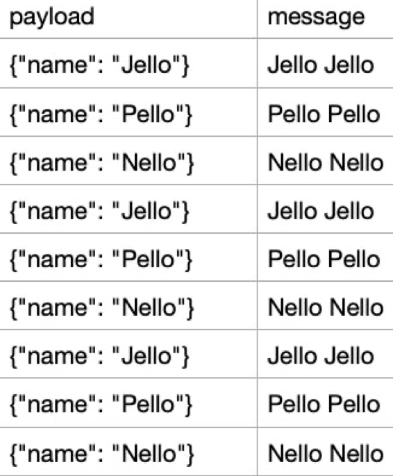

Now take a look at the message and payload column of each function:

Since each experiment file defined payloads for the function, those payloads were used in the function invocation.

Instead of supplying a specific set of payloads to each function in the pipeline it may be necessary to pass the results from one function invocation to another.

Let's try and pass the response message from each function to the next, resulting in a final message of "Nello Pello Jello Jello"

## Command Line Arguments and Passing Attributes in a Pipeline

FaaS Runner has the built-in attribute ​**passPayloads** that does just that! By default, this attribute is false so we can override that with command line arguments just like with single function experiments. Run the same experiment again but add the ​**"--passPayloads true"​** flag.

```bash
./faas_runner.py -f ./functions/jello.json ./functions/pello.json ./functions/nello.json -e ./experiments/jello.json ./experiments/pello.json ./experiments/nello.json ​--passPayloads true
```

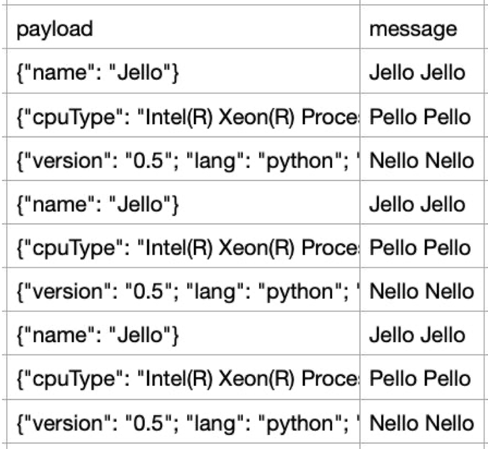

As we can see now ALL attributes returned by previous functions are passed onto the payload of the next function invocation. But our message response is still unchanged.

This is because the Hello World functions expects an attribute called "name" as the input and returns the response in the "message" attribute. Between function invocations we need to rename "message" to "name" to get the desired output we want.

To do this, we can use FaaS Runner's ​**transitions** attribute. This attribute expects a JSON object of key value pairs that will rename one attribute to another between function invocations. Like we did with passPayloads we can define this through command line arguments:

```bash
./faas_runner.py -f ./functions/jello.json ./functions/pello.json ./functions/nello.json -e ./experiments/jello.json ./experiments/pello.json ./experiments/nello.json --passPayloads true --transitions {\"message\":\"name\"}
```

FaaS Runner is passing all attributes from the response of one function into the request of the next. While it does that, it renames the "message" attribute to "name" as defined by the transition attribute.

By default, when a command line argument is used to override something it applies it to ALL experiment/function files. If you want to only apply an argument to one specific function in the pipeline you can add array-style indexes to the argument (starting at 0). For example, if we want to do the same experiment but only pass arguments from the first function to the second, we can apply ​**passPayloads** only to the second function:

```bash
./faas_runner.py -f ./functions/jello.json ./functions/pello.json ./functions/nello.json -e
./experiments/jello.json ./experiments/pello.json ./experiments/nello.json
--passPayloads[1] true --transitions {\"message\":\"name\"}
```

This syntax can be applied to any attribute. If you want to have specific transitions between functions in a pipeline you can define that this way. This also allows complete pipelines to be entirely defined through command line arguments. For example, the same pipeline can be executed without using function or experiment files:

```bash
./faas_runner.py --function[0] jelloWorld --function[1] pelloWorld --function[2] nelloWorld --runs 3 --threads 1 --payloads [{\"name\":\"Jello\"}] --passPayloads true --transitions {\"message\":\"name\"}
```

## Dynamic Pipelines and State Machines

For the most complex pipelines, FaaS Runner can be used to orchestrate function execution by modifying **test/tools/pipeline_transition.py​**.

```python
def​ ​transition_function​(​index​, ​functions,​ ​experiments,​ ​payloads,​ ​lastPayload​): ​
	return​ (index + 1, functions, experiments, payloads, lastPayload)
```

This is the default transition function, after each execution, increment the index to go to the next function; leaving the functions, experiments, and payloads unchanged. To better understand what data is being passed through here, add a few comments to ​**pipeline_transition.py​** and rerun the previous pipeline:

```python
def​ ​transition_function​(​index​, ​functions,​ ​experiments,​ ​payloads,​ ​lastPayload​):

	​print​(​"​------------------ INDEX ------------------​"​) ​
	print​(​str​(index))
	​print​(​"​------------------ FUNCTIONS ------------------​"​) ​
	print​(​str​(functions))
	​print​(​"​------------------ EXPERIMENTS ------------------​"​) ​
	print​(​str​(experiments))
	​print​(​"​------------------ PAYLOADS ------------------​"​) ​
	print​(​str​(payloads))
	​print​(​"​------------------ LAST PAYLOAD ------------------​"​) ​
	print​(​str​(lastPayload)) ​
	print​(​"​------------------------------------​"​)

	​return​ (index ​+​ ​1​, functions, experiments, payloads, lastPayl
```

**Task 2:** Using the experiment defined below, create a transition function that skips the 2nd function (pelloWorld) if the first function returns a message of "Jello End" otherwise execute the pipeline normally.

```bash
./faas_runner.py --function[0] jelloWorld --function[1] pelloWorld --function[2] nelloWorld --runs 10 --threads 1 --payloads [{\"name\":\"Jello\"},{\"name\":\"End\"}] --passPayloads true --transitions {\"message\":\"name\"} --shufflePayloads true
```
Solution:

```python
def transition_function(​index,​ ​functions,​ ​experiments,​ ​payloads​, ​lastPayload)​: 
	if (lastPayload["message"] == "Jello End"):
		index += 1
	return (index + 1, functions, experiments, payloads, lastPayload)
```

Congratulation you are now a master of SAAF and FaaS Runner! You can deploy functions to a variety of FaaS platforms and can run complex experiments.